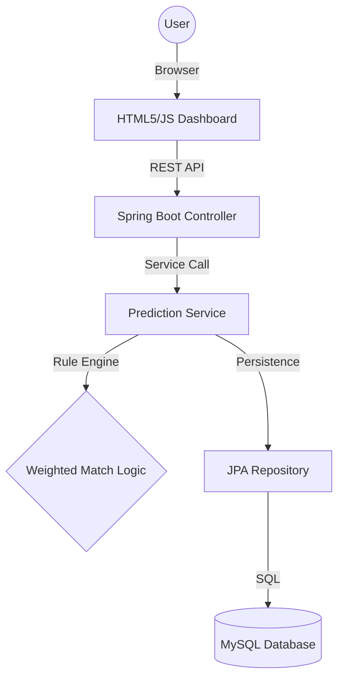

# Cloud-Based Healthcare Disease Prediction System

A modern, rule-based healthcare screening portal designed for preliminary disease prediction and population-level health analytics. Built with **Spring Boot**, **MySQL**, and **Chart.js**.

## 🚀 Overview

This system provides a high-end digital interface for patients to enter symptoms and receive automated diagnostic suggestions based on a weighted coverage algorithm. It also features a real-time analytics dashboard to track disease distribution across all stored records.

### Key Features
- **Symptom Analysis**: Intelligent weighted matching algorithm that prioritizes the best-fitting disease profile.
- **Interactive UI**: A premium, dashboard-style interface with glassmorphism and real-time validation.
- **Population Trends**: Live donut chart showing the distribution of predictions across the database.
- **Persistence**: Securely stores patient records and predictions in a MySQL database.

## 🏗️ Technical Architecture



## 🛠️ Technology Stack
- **Backend**: Java 17, Spring Boot 3.x, Spring Data JPA
- **Database**: MySQL 8.x
- **Frontend**: HTML5, Vanilla CSS3 (Glassmorphism), JavaScript (ES6+)
- **Charts**: Chart.js (v4.x)
- **Build Tool**: Maven

## ⚙️ Installation & Setup

### 1. Prerequisites
- Java 17 or higher
- MySQL Server
- Maven (or use included `mvnw`)

### 2. Database Setup
Create a database named `health_pred_db`:
```sql
CREATE DATABASE health_pred_db;
```

### 3. Configuration
1. Navigate to `src/main/resources`.
2. Copy `application.properties.example` to `application.properties`.
3. Update the `spring.datasource.username` and `spring.datasource.password` with your local MySQL credentials.

### 4. Run the Application
```bash
./mvnw spring-boot:run
```
Access the application at `http://localhost:8080`.

## 🧠 Prediction Logic
The system uses a **Weighted Coverage Algorithm**:
- **Coverage**: (Matches / Total Symptoms in Rule)
- **Selection**: The disease with the highest coverage percentage wins. If coverage is tied, the one with the highest absolute match count is selected.
- **Confidence**: Automatically calculated based on coverage density and match count.

## 📄 License
This project is licensed under the MIT License - see the [LICENSE](LICENSE) file for details.
